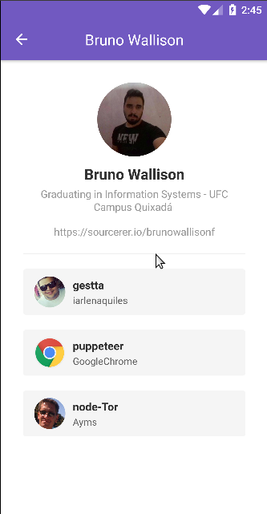
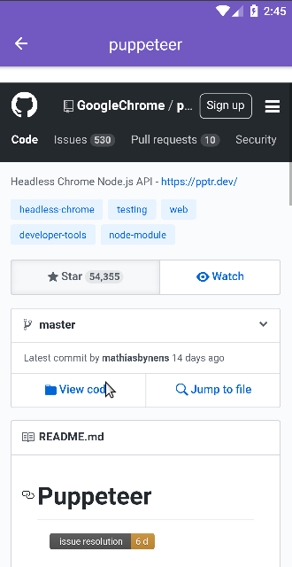

# Starred Repositories

## Aplicação em React native desafio do Bootcamp 8.0 da Rocketseat

### Tecnologias

- React Native
- Reactotron
- Styled Components
- Axios

### Funcionalidades

- Adição de usuarios
- Listagem de repositórios "Starred" de cada usuario
- Visualização de cada repositório em uma webview

# Repositories

### Desafio 5 do Bootcamp 8 da Rocketseat

#### Funcionalidades

- Adicionar repositorio
- Ver detales do repositorio

# Tecnologias

- ReactJS
- Axios
- Styled Components
- React Router Dom

## Run

yarn &&
yarn start
